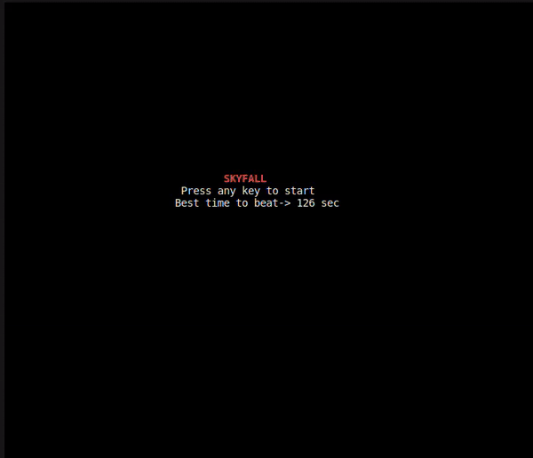

# Skyfall

**A dynamic survival game built with ncurses in C**

## Overview

In **Skyfall**, players navigate through increasingly challenging environments, striving to dodge obstacles and reach safety. This text-based adventure is built within a 30x80 grid, optimizing gameplay for standard terminal windows.

## GAME PLAN

### Objectives

- **Per Level:** Evade obstacles to reach the end point unscathed.
- **Game Objective:** Advance through all levels, maximizing survival time to achieve the highest score.

### Gameplay Dynamics

- **Levels:** The game consists of two main levels, **Easy** and **Hard**. Gameplay begins in Easy mode and automatically escalates to Hard mode after 60 seconds, intensifying the challenge.
- **Movement:** Navigate using arrow keys.
- **Power-Ups:** Utilize "s" (one-time use) to slow down gameplay or "i" (one-time use) for temporary immunity against obstacles. NOTE: Each power-up only lasts **20 sec**

## Starting Up

### Splash Screen/Home Screen

At launch, **Skyfall** greets players with a home screen, featuring the game title and best time to beat. The splash screen menu offers options to activate a power-ups, pause, or exit the game. Which also displays key instructions and notify user when power-ups are activated or done.

### Controls and Mechanics

- **Pause:** "p" halts the game, resuming only upon a subsequent "p" press.
- **Quit:** "q" triggers a prompt for exiting; "y" confirms, while "n" continues the adventure.

Embark on a journey of agility and strategy in **Skyfall**, where every second counts toward ultimate survival.

